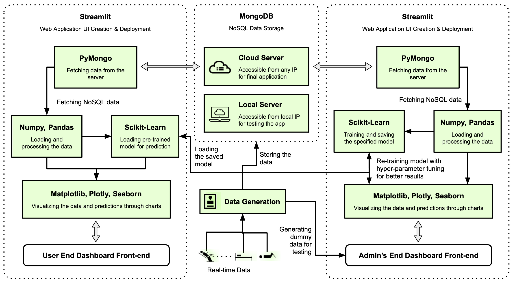
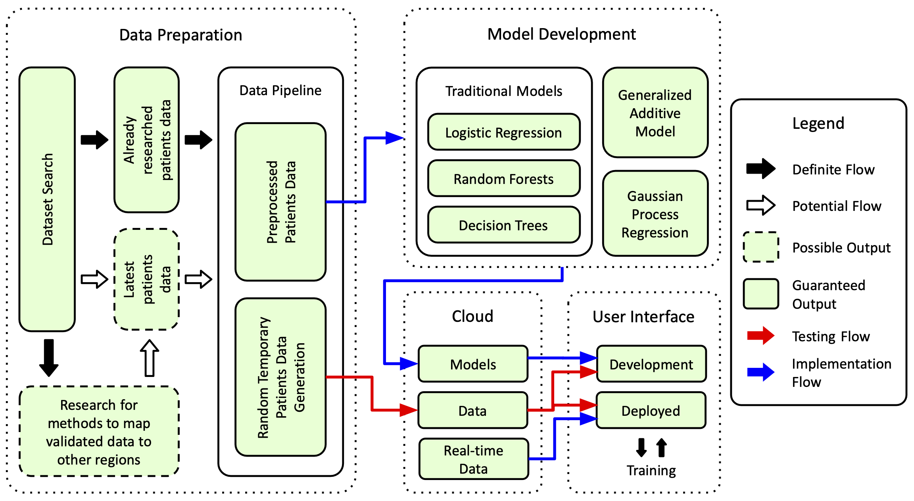

# ReCura: Comprehensive Health Monitoring Dashboard

## Overview

ReCura is an integrated health monitoring system designed to provide real-time insights into patient health metrics and predict readmission risk. The platform uses machine learning models to analyze patient data and provide healthcare professionals and patients with actionable information.

## Architecture

ReCura follows a three-tier architecture:

### 1. Data Preparation

- **Dataset Search**: Collection of patient health records from various sources
- **Data Pipeline**: Processing raw data into structured formats ready for analysis
- **Random Data Generation**: Temporary data creation for development and testing

### 2. Model Development

- Implementation of multiple prediction algorithms:
  - Logistic Regression
  - Random Forests
  - Decision Trees

### 3. Application Deployment

#### MongoDB (NoSQL Database)
- Cloud and local server options for data storage
- Real-time data collection and persistence
- Secure storage of patient records

#### Streamlit Web Applications
- **Patient Dashboard**: Personalized health metrics visualization
- **Admin Dashboard**: Healthcare provider interface with comprehensive analytics
- **Authentication**: Secure login system for both patients and administrators

## Technology Stack

- **Frontend**: Streamlit for responsive web interface
- **Backend**: Python data processing and ML pipeline
- **Database**: MongoDB for flexible NoSQL storage
- **Data Processing**: Pandas, NumPy for efficient data manipulation
- **Machine Learning**: Scikit-learn for predictive modeling
- **Visualization**: Plotly, Matplotlib for interactive charts

## Key Features

- Real-time health metrics monitoring
- Readmission risk prediction using multiple ML models
- Interactive data visualization
- Dual interface for patients and healthcare administrators
- Secure authentication system
- Cloud-based data storage

## Environment Setup

ReCura requires the following environment variables:

- `MONGODB_URI`: Connection string for your MongoDB database

Create a `.env` file in the project root with these variables before running the application.

## Getting Started

1. Clone the repository
2. Install dependencies: `pip install -r requirements.txt`
3. Configure MongoDB connection
4. Run the application: `streamlit run main.py`
5. Run random data generation for specific user ID: `python run mongodb_worker/mongodb_store_data.py`

---

ReCura: One Health Dashboard - Proactive, precise, and perfectly tailored health management.